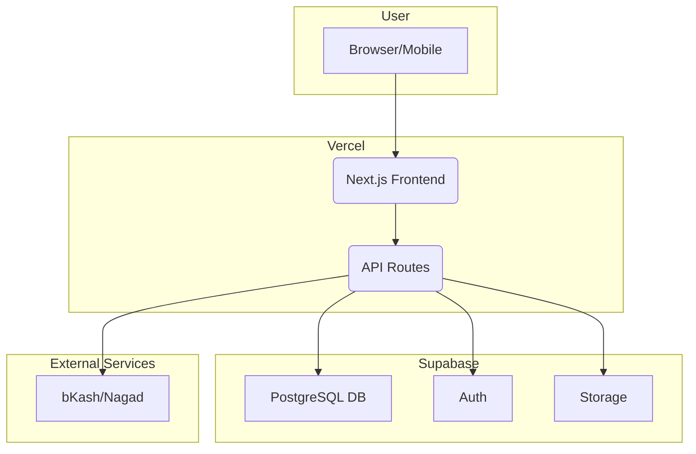
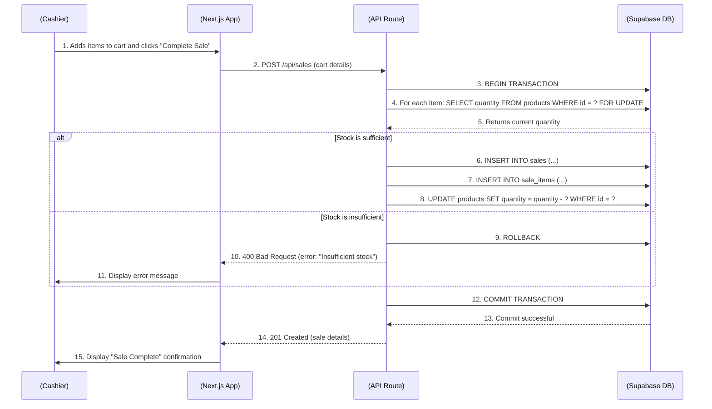
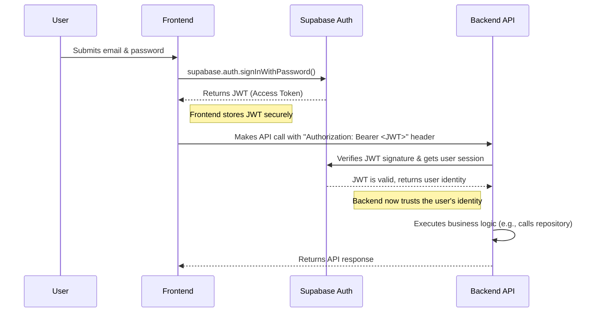
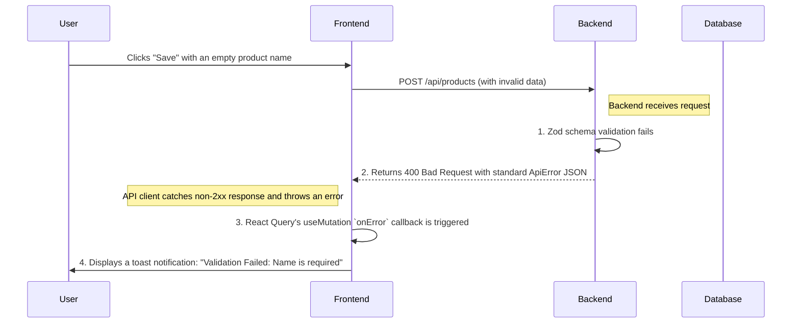

# SaaS Platform for Grocery Shops Fullstack Architecture Document

## Introduction

This document outlines the complete fullstack architecture for the "SaaS Platform for Grocery Shops", including backend systems, frontend implementation, and their integration. It serves as the single source of truth for AI-driven development, ensuring consistency across the entire technology stack.

This unified approach combines what would traditionally be separate backend and frontend architecture documents, streamlining the development process for modern fullstack applications where these concerns are increasingly intertwined.

### Starter Template or Existing Project

N/A - Greenfield project.

### Change Log

| Date | Version | Description | Author |
| :--- | :--- | :--- | :--- |
| 2025-10-17 | 1.0 | Initial draft | Winston (Architect) |

## High Level Architecture

#### Technical Summary

This architecture outlines a modern, scalable, and maintainable full-stack solution for the "SaaS Platform for Grocery Shops". It is designed as a modular monolith, leveraging a serverless-first approach for the backend and a component-based, single-page application for the frontend. The key integration point is a REST API. The entire system will be hosted on a major cloud platform to ensure scalability and reliability, directly supporting the PRD's goals of a robust and scalable platform.

#### Platform and Infrastructure Choice

**Platform:** Vercel + Supabase
**Key Services:** Vercel (Hosting, CDN), Supabase (PostgreSQL, Auth, Storage)
**Deployment Host and Regions:** Vercel Edge Network (Global), Supabase (nearest region to Bangladesh)

#### Repository Structure

**Structure:** Monorepo
**Monorepo Tool:** npm workspaces
**Package Organization:**
- `apps/web`: The Next.js frontend application.
- `apps/api`: The backend API (e.g., Express.js or Next.js API routes).
- `packages/shared`: Shared code, such as TypeScript types and validation schemas.
- `packages/ui`: Shared UI components.

#### High Level Architecture Diagram



#### Architectural Patterns

-   **Jamstack Architecture:** The frontend will be a static or server-rendered application, consuming APIs for dynamic functionality. _Rationale:_ Optimal performance, scalability, and security.
-   **Component-Based UI:** The frontend will be built with reusable React components. _Rationale:_ Maintainability, consistency, and reusability.
-   **Repository Pattern:** The backend will use a repository pattern to abstract data access logic. _Rationale:_ Decouples business logic from data sources, improving testability and flexibility.
-   **API Gateway Pattern:** All API requests will be routed through a single gateway (Vercel's API routes). _Rationale:_ Centralized point for routing, authentication, and logging.

## Tech Stack

| Category | Technology | Version | Purpose | Rationale |
| :--- | :--- | :--- | :--- | :--- |
| **Frontend Language** | TypeScript | latest | Language for frontend development | Provides type safety and better developer experience. |
| **Frontend Framework** | Next.js (React) | latest | Framework for the web application | Full-stack capabilities, server-side rendering, and a rich ecosystem. |
| **UI Component Library**| Shadcn/UI | latest | Reusable UI components | Composable and accessible components that can be customized. |
| **State Management** | Zustand | latest | Frontend state management | Simple, lightweight, and unopinionated state management library. |
| **Backend Language** | TypeScript | latest | Language for backend development | Consistent language across the stack, improving developer productivity. |
| **Backend Framework** | Next.js API Routes | latest | Framework for the backend API | Integrated with the frontend, simplifying development and deployment. |
| **API Style** | REST | N/A | API communication style | Well-understood, widely supported, and a good fit for this application. |
| **Database** | PostgreSQL | latest | Primary data store | Provided by Supabase, a powerful and reliable relational database. |
| **Cache** | Vercel Edge Cache | N/A | Caching layer for performance | Integrated with Vercel, provides automatic caching at the edge. |
| **File Storage** | Supabase Storage | N/A | Storing user-uploaded files | Integrated with Supabase, provides a simple and secure file storage solution. |
| **Authentication** | Supabase Auth | N/A | User authentication and authorization | Integrated with Supabase, provides a secure and easy-to-use auth solution. |
| **Frontend Testing** | Jest + RTL | latest | Testing frontend components | Industry standard for testing React applications. |
| **Backend Testing** | Jest | latest | Testing backend API routes | Consistent testing framework across the stack. |
| **E2E Testing** | Playwright | latest | End-to-end testing | Modern and powerful E2E testing framework from Microsoft. |
| **Build Tool** | Next.js CLI | latest | Building the application | Integrated with Next.js, provides a seamless build experience. |
| **Bundler** | Webpack 5 | latest | Bundling application assets | Handled automatically by Next.js, powerful and extensible. |
| **IaC Tool** | N/A | N/A | Infrastructure as Code | Vercel and Supabase manage the infrastructure, so no dedicated tool is needed. |
| **CI/CD** | GitHub Actions | N/A | Continuous integration and deployment | Native to GitHub, easy to set up for Vercel deployments. |
| **Monitoring** | Vercel Analytics | N/A | Application monitoring | Integrated with Vercel, provides real-time performance and usage metrics. |
| **Logging** | Vercel Logs | N/A | Application logging | Integrated with Vercel, provides real-time logs for the application. |
| **CSS Framework** | Tailwind CSS | latest | Styling the application | Used by Shadcn/UI, provides a utility-first approach to styling. |

## Data Models

#### User

**Purpose:** Represents an individual who can log in and interact with the system, such as a store owner or a cashier.

**Key Attributes:**
- `id`: `UUID` - The unique identifier for the user, generated by Supabase Auth.
- `email`: `string` - The user's email address, used for login.
- `created_at`: `timestamp` - The timestamp when the user account was created.

**TypeScript Interface:**
```typescript
interface User {
  id: string; // UUID
  email: string;
  created_at: string; // ISO 8601 date string
}
```

**Relationships:**
- A `User` can be associated with one or more `Store` entities, managed through a separate `StoreUser` join table to handle roles and permissions.

#### Store

**Purpose:** Represents a single retail grocery shop. It acts as the top-level container for most other data, including products, sales, and employees.

**Key Attributes:**
- `id`: `UUID` - The unique identifier for the store.
- `name`: `string` - The legal or display name of the store.
- `address`: `text` - The physical address of the store.
- `owner_id`: `UUID` - A foreign key referencing the `id` of the user who owns the store.

**TypeScript Interface:**
```typescript
interface Store {
  id: string; // UUID
  name: string;
  address: string;
  owner_id: string; // UUID of the User
}
```

**Relationships:**
- **Owns:** A `Store` has one primary `User` (the owner).
- **Has Many:** A `Store` has many `Product`s, `Sale`s, and `Customer`s.
- **Has Many (Through):** A `Store` has many `User`s (employees) through the `StoreUser` join table.

#### Product

**Purpose:** Represents an item for sale in a store's inventory.

**Key Attributes:**
- `id`: `UUID` - The unique identifier for the product.
- `store_id`: `UUID` - A foreign key referencing the `Store` this product belongs to.
- `name`: `string` - The display name of the product.
- `price`: `decimal` - The selling price of the product.
- `quantity`: `integer` - The current stock on hand.
- `sku`: `string` (optional) - The Stock Keeping Unit.

**TypeScript Interface:**
```typescript
interface Product {
  id: string; // UUID
  store_id: string; // UUID
  name: string;
  price: number;
  quantity: number;
  sku?: string;
}
```

**Relationships:**
- **Belongs To:** A `Product` belongs to one `Store`.
- **Has Many:** A `Product` can appear in many `Sale` line items.

#### Sale

**Purpose:** Represents a single, completed transaction at the Point of Sale.

**Key Attributes:**
- `id`: `UUID` - The unique identifier for the transaction.
- `store_id`: `UUID` - A foreign key referencing the `Store` where the sale occurred.
- `total_amount`: `decimal` - The total value of the sale.
- `created_at`: `timestamp` - The timestamp when the sale was completed.

**TypeScript Interface:**
```typescript
interface Sale {
  id: string; // UUID
  store_id: string; // UUID
  total_amount: number;
  created_at: string; // ISO 8601 date string
}
```

**Relationships:**
- **Belongs To:** A `Sale` belongs to one `Store`.
- **Has Many:** A `Sale` has many `SaleItem`s.

#### SaleItem

**Purpose:** Represents a single line item within a `Sale`. It links a `Product` to a `Sale` and records the quantity and price at the time of the transaction.

**Key Attributes:**
- `id`: `UUID` - The unique identifier for the line item.
- `sale_id`: `UUID` - A foreign key referencing the `Sale` this item belongs to.
- `product_id`: `UUID` - A foreign key referencing the `Product` that was sold.
- `quantity`: `integer` - The number of units of the product that were sold.
- `price_at_sale`: `decimal` - The price of a single unit at the time of the sale.

**TypeScript Interface:**
```typescript
interface SaleItem {
  id: string; // UUID
  sale_id: string; // UUID
  product_id: string; // UUID
  quantity: number;
  price_at_sale: number;
}
```

**Relationships:**
- **Belongs To:** A `SaleItem` belongs to one `Sale` and one `Product`.

#### Customer

**Purpose:** Represents a customer of the shop, allowing for purchase history tracking and basic CRM functionality.

**Key Attributes:**
- `id`: `UUID` - The unique identifier for the customer.
- `store_id`: `UUID` - A foreign key referencing the `Store` this customer is associated with.
- `name`: `string` - The customer's full name.
- `phone`: `string` (optional) - The customer's phone number.
- `email`: `string` (optional) - The customer's email address.

**TypeScript Interface:**
```typescript
interface Customer {
  id: string; // UUID
  store_id: string; // UUID
  name: string;
  phone?: string;
  email?: string;
}
```

**Relationships:**
- **Belongs To:** A `Customer` belongs to one `Store`.
- **Has Many:** A `Customer` can have many `Sale`s. This relationship can be established by adding an optional `customer_id` to the `Sale` table.

#### Supplier

**Purpose:** Represents a vendor or supplier from whom the store purchases goods.

**Key Attributes:**
- `id`: `UUID` - The unique identifier for the supplier.
- `store_id`: `UUID` - A foreign key referencing the `Store` this supplier is associated with.
- `name`: `string` - The supplier's company name.
- `contact_name`: `string` (optional) - The name of the contact person.
- `phone`: `string` (optional) - The supplier's phone number.

**TypeScript Interface:**
```typescript
interface Supplier {
  id: string; // UUID
  store_id: string; // UUID
  name: string;
  contact_name?: string;
  phone?: string;
}
```

**Relationships:**
- **Belongs To:** A `Supplier` is associated with one `Store`.
- **Has Many:** A `Supplier` can be associated with many `Purchase`s.

#### Purchase

**Purpose:** Represents a record of stock being added to the inventory from a supplier.

**Key Attributes:**
- `id`: `UUID` - The unique identifier for the purchase record.
- `store_id`: `UUID` - A foreign key referencing the `Store`.
- `product_id`: `UUID` - A foreign key referencing the `Product` being purchased.
- `supplier_id`: `UUID` (optional) - A foreign key referencing the `Supplier`.
- `quantity`: `integer` - The number of units purchased.
- `cost_price`: `decimal` - The cost per unit of the product.
- `purchase_date`: `timestamp` - The date the purchase was made.

**TypeScript Interface:**
```typescript
interface Purchase {
  id: string; // UUID
  store_id: string; // UUID
  product_id: string; // UUID
  supplier_id?: string; // UUID
  quantity: number;
  cost_price: number;
  purchase_date: string; // ISO 8601 date string
}
```

**Relationships:**
- **Belongs To:** A `Purchase` record is associated with one `Store` and one `Product`. It can optionally be linked to a `Supplier`.

#### Order

**Purpose:** Represents a customer's order placed through the public e-commerce storefront.

**Key Attributes:**
- `id`: `UUID` - The unique identifier for the order.
- `store_id`: `UUID` - A foreign key referencing the `Store`.
- `customer_id`: `UUID` - A foreign key referencing the `Customer` who placed the order.
- `total_amount`: `decimal` - The total value of the order, including any taxes or shipping.
- `status`: `string` - The current status of the order (e.g., `pending_payment`, `paid`, `processing`, `out_for_delivery`, `delivered`, `cancelled`).
- `delivery_address`: `text` - The full delivery address provided by the customer.
- `created_at`: `timestamp` - The timestamp when the order was placed.

**TypeScript Interface:**
```typescript
type OrderStatus = 'pending_payment' | 'paid' | 'processing' | 'out_for_delivery' | 'delivered' | 'cancelled';

interface Order {
  id: string; // UUID
  store_id: string; // UUID
  customer_id: string; // UUID
  total_amount: number;
  status: OrderStatus;
  delivery_address: string;
  created_at: string; // ISO 8601 date string
}
```

**Relationships:**
- **Belongs To:** An `Order` belongs to one `Store` and one `Customer`.
- **Has Many:** An `Order` has many `OrderItem`s.

#### OrderItem

**Purpose:** Represents a single product line item within an `Order`.

**Key Attributes:**
- `id`: `UUID` - The unique identifier for the line item.
- `order_id`: `UUID` - A foreign key referencing the `Order` this item belongs to.
- `product_id`: `UUID` - A foreign key referencing the `Product` that was ordered.
- `quantity`: `integer` - The number of units ordered.
- `price_at_purchase`: `decimal` - The price of a single unit at the time the order was placed.

**TypeScript Interface:**
```typescript
interface OrderItem {
  id: string; // UUID
  order_id: string; // UUID
  product_id: string; // UUID
  quantity: number;
  price_at_purchase: number;
}
```

**Relationships:**
- **Belongs To:** An `OrderItem` belongs to one `Order` and one `Product`.

#### BillOfMaterials (BOM)

**Purpose:** Defines the recipe for a manufactured product, listing all the raw materials and components required to produce it.

**Key Attributes:**
- `id`: `UUID` - The unique identifier for the BOM itself.
- `store_id`: `UUID` - A foreign key referencing the `Store`.
- `product_id`: `UUID` - A foreign key referencing the finished `Product` that this BOM describes.

**TypeScript Interface:**
```typescript
interface BillOfMaterials {
  id: string; // UUID
  store_id: string; // UUID
  product_id: string; // UUID of the finished good
}
```

**Relationships:**
- **Belongs To:** A `BillOfMaterials` is associated with one `Store` and one finished `Product`.
- **Has Many:** A `BillOfMaterials` has many `BomItem`s.

#### BomItem

**Purpose:** Represents a single line item in a `BillOfMaterials`, specifying one raw material and the quantity required.

**Key Attributes:**
- `id`: `UUID` - The unique identifier for the BOM line item.
- `bom_id`: `UUID` - A foreign key referencing the `BillOfMaterials` this item belongs to.
- `raw_material_id`: `UUID` - A foreign key referencing the `Product` that serves as the raw material.
- `quantity`: `decimal` - The quantity of the raw material required for one unit of the finished good.

**TypeScript Interface:**
```typescript
interface BomItem {
  id: string; // UUID
  bom_id: string; // UUID
  raw_material_id: string; // UUID of a Product
  quantity: number;
}
```

**Relationships:**
- **Belongs To:** A `BomItem` belongs to one `BillOfMaterials` and references one `Product` (as a raw material).

#### ProductionOrder

**Purpose:** An instruction to manufacture a specific quantity of a product, which will consume raw materials and create finished goods.

**Key Attributes:**
- `id`: `UUID` - The unique identifier for the production order.
- `store_id`: `UUID` - A foreign key referencing the `Store`.
- `product_id`: `UUID` - A foreign key referencing the `Product` to be manufactured.
- `quantity_to_produce`: `integer` - The target quantity of the finished good.
- `status`: `string` - The current status of the order (e.g., `planned`, `in_progress`, `completed`, `cancelled`).
- `created_at`: `timestamp` - The timestamp when the order was created.
- `completed_at`: `timestamp` (nullable) - The timestamp when the order was completed.

**TypeScript Interface:**
```typescript
type ProductionStatus = 'planned' | 'in_progress' | 'completed' | 'cancelled';

interface ProductionOrder {
  id: string; // UUID
  store_id: string; // UUID
  product_id: string; // UUID of the finished good
  quantity_to_produce: number;
  status: ProductionStatus;
  created_at: string; // ISO 8601 date string
  completed_at?: string; // ISO 8601 date string
}
```

**Relationships:**
- **Belongs To:** A `ProductionOrder` is associated with one `Store` and one `Product`.

## API Specification

This section defines the contract for the REST API.

```yaml
openapi: 3.0.0
info:
  title: SaaS Platform for Grocery Shops API
  version: 1.0.0
  description: The REST API for the SaaS Platform for Grocery Shops, providing resources for managing retail operations.
servers:
  - url: /api
    description: API base path

# =====================================================================================
# Paths
# =====================================================================================
paths:
  /products:
    get:
      summary: List Products
      description: Retrieves a list of all products for the authenticated user's store.
      tags:
        - Products
      responses:
        '200':
          description: A JSON array of products.
          content:
            application/json:
              schema:
                type: array
                items:
                  $ref: '#/components/schemas/Product'
        '401':
          $ref: '#/components/responses/UnauthorizedError'

    post:
      summary: Create Product
      description: Creates a new product in the store's inventory.
      tags:
        - Products
      requestBody:
        required: true
        content:
          application/json:
            schema:
              $ref: '#/components/schemas/NewProduct'
      responses:
        '201':
          description: The newly created product.
          content:
            application/json:
              schema:
                $ref: '#/components/schemas/Product'
        '400':
          $ref: '#/components/responses/BadRequestError'
        '401':
          $ref: '#/components/responses/UnauthorizedError'

  /products/{productId}:
    get:
      summary: Get Product
      description: Retrieves a single product by its ID.
      tags:
        - Products
      parameters:
        - name: productId
          in: path
          required: true
          schema:
            type: string
            format: uuid
      responses:
        '200':
          description: A single product.
          content:
            application/json:
              schema:
                $ref: '#/components/schemas/Product'
        '401':
          $ref: '#/components/responses/UnauthorizedError'
        '404':
          $ref: '#/components/responses/NotFoundError'

# =====================================================================================
# Components
# =====================================================================================
components:
  schemas:
    Product:
      type: object
      properties:
        id:
          type: string
          format: uuid
        store_id:
          type: string
          format: uuid
        name:
          type: string
        price:
          type: number
          format: decimal
        quantity:
          type: integer
        sku:
          type: string
          nullable: true

    NewProduct:
      type: object
      required:
        - name
        - price
        - quantity
      properties:
        name:
          type: string
        price:
          type: number
          format: decimal
        quantity:
          type: integer
        sku:
          type: string
          nullable: true

    ApiError:
      type: object
      properties:
        error:
          type: object
          properties:
            code:
              type: string
              example: "bad_request"
            message:
              type: string
              example: "Invalid input provided."
            timestamp:
              type: string
              format: date-time
            requestId:
              type: string
              format: uuid

  responses:
    UnauthorizedError:
      description: Authentication information is missing or invalid.
      content:
        application/json:
          schema:
            $ref: '#/components/schemas/ApiError'
    BadRequestError:
      description: The request body is malformed or invalid.
      content:
        application/json:
          schema:
            $ref: '#/components/schemas/ApiError'
    NotFoundError:
      description: The requested resource was not found.
      content:
        application/json:
          schema:
            $ref: '#/components/schemas/ApiError'
```

## Components

#### Web Frontend (Next.js Application)

**Responsibility:** This is the primary user-facing component. It serves both the internal-facing application for store owners (POS, inventory, settings) and the public-facing e-commerce storefront for shoppers. It is responsible for rendering all UI, managing client-side state, and interacting with the backend API.

**Key Interfaces:**
- **UI:** Renders HTML, CSS, and JavaScript to the user's browser.
- **REST API Client:** Communicates with the backend API via HTTP requests to fetch and mutate data.
- **Auth Client:** Interacts directly with the Supabase Auth client-side library to handle user sign-in, sign-up, and session management.

**Dependencies:**
- **Backend API:** Relies on the API for all business logic and data persistence.
- **Supabase Auth:** Depends on the Supabase service for user authentication.

**Technology Stack:** Next.js, React, TypeScript, Tailwind CSS, Shadcn/UI, Zustand.

#### Backend API (Next.js API Routes)

**Responsibility:** This component is the authoritative core of the application. It executes all business logic, enforces security rules, and handles all data persistence. It is responsible for processing requests from the frontend, interacting with the database, and integrating with any third-party services.

**Key Interfaces:**
- **REST API:** Exposes a set of HTTP endpoints (defined in the OpenAPI specification) that the frontend consumes.
- **Database Client:** Connects to the PostgreSQL database via the Supabase client to perform CRUD (Create, Read, Update, Delete) operations.
- **External Service Integrations:** Communicates with external APIs, such as bKash/Nagad for payment processing.

**Dependencies:**
- **PostgreSQL Database (Supabase):** Relies on the database for all data storage.
- **Supabase Auth:** Uses the Supabase admin SDK to validate user sessions and permissions.
- **External APIs:** Depends on the availability and contracts of third-party services.

**Technology Stack:** Next.js API Routes, TypeScript.

#### Database (PostgreSQL via Supabase)

**Responsibility:** This component is the system's long-term memory. It is responsible for the persistent storage of all application data, such as users, products, orders, and sales. It also enforces data integrity through schemas, constraints, and relationships. In the Supabase model, it also plays a key role in authorization via Row-Level Security (RLS).

**Key Interfaces:**
- **SQL Interface:** Exposes a standard SQL interface that the Backend API uses to query and manipulate data.
- **Connection Pooling:** Provides managed, secure connections to the backend.
- **Security Policies:** Exposes an interface for defining and managing Row-Level Security policies.

**Dependencies:**
- This is a foundational component with no external dependencies.

**Technology Stack:** PostgreSQL.

## External APIs

#### bKash Payment Gateway API

- **Purpose:** To securely process online payments from customers for orders placed on the e-commerce storefront.
- **Documentation:** To be provided. The exact implementation will depend on the official developer documentation from bKash.
- **Base URL(s):** Will include a sandbox URL for testing and a production URL for live payments.
- **Authentication:** Typically via an App Key and App Secret provided by bKash. These will be stored securely as environment variables on the backend.
- **Rate Limits:** To be determined from the official documentation.

**Key Endpoints Used (Example Flow):**
- `POST /token` - To obtain an authentication token for making other API calls.
- `POST /payment/create` - To initiate a payment request and get a payment URL to redirect the user to.
- `POST /payment/execute` - To confirm and execute the payment after the user has approved it on the bKash platform.
- `GET /payment/status` - To query the status of a transaction after the user is redirected back to our site.

**Integration Notes:** The integration will be handled exclusively by the **Backend API** component to ensure security. A dedicated server-side module will be created to encapsulate all interactions with the bKash API, handling the token exchange, payment creation, and execution flow. The frontend will not interact with the bKash API directly.

#### Nagad Payment Gateway API

- **Purpose:** To provide a second major option for customers to process online payments, increasing the flexibility of the e-commerce platform.
- **Documentation:** To be provided. The implementation will follow the official developer documentation from Nagad.
- **Base URL(s):** Will include separate sandbox and production URLs.
- **Authentication:** Expected to be via a Merchant ID and API Key provided by Nagad, stored securely on the backend.
- **Rate Limits:** To be determined from the official documentation.

**Key Endpoints Used (Example Flow):**
- `POST /remote-payment-gateway-payment` - To initiate a payment and receive a checkout URL.
- `GET /remote-payment-gateway-payment/{paymentRefId}` - To verify the status of the payment after the user returns to the site.

**Integration Notes:** Similar to the bKash integration, this will be a backend-only responsibility. A dedicated server-side module will be created to handle the specific API flow for Nagad. The frontend will be abstracted from the details of which payment gateway is being used.

## Core Workflows

This section uses sequence diagrams to illustrate critical user journeys. Here is the workflow for an in-store Point of Sale (POS) transaction.



## Database Schema

This section provides the SQL Data Definition Language (DDL) for creating the database tables. This schema is designed for PostgreSQL.

```sql
-- Create a custom type for user roles within a store
CREATE TYPE store_role AS ENUM ('owner', 'cashier');

-- Table for Stores
CREATE TABLE stores (
    id UUID PRIMARY KEY DEFAULT uuid_generate_v4(),
    name TEXT NOT NULL,
    address TEXT,
    owner_id UUID NOT NULL REFERENCES auth.users(id) ON DELETE CASCADE
);
-- Enable Row-Level Security (RLS) for stores
ALTER TABLE stores ENABLE ROW LEVEL SECURITY;
-- Policy: Users can only see stores they are a member of.
CREATE POLICY "Users can see their own stores" ON stores FOR SELECT
USING ( auth.uid() IN (SELECT user_id FROM store_users WHERE store_id = id) );


-- Join table to link Users to Stores with a specific role
CREATE TABLE store_users (
    id UUID PRIMARY KEY DEFAULT uuid_generate_v4(),
    store_id UUID NOT NULL REFERENCES stores(id) ON DELETE CASCADE,
    user_id UUID NOT NULL REFERENCES auth.users(id) ON DELETE CASCADE,
    role store_role NOT NULL,
    UNIQUE(store_id, user_id)
);
-- Enable RLS for store_users
ALTER TABLE store_users ENABLE ROW LEVEL SECURITY;
-- Policy: Users can see their own membership record.
CREATE POLICY "Users can see their own store_user record" ON store_users FOR SELECT
USING ( auth.uid() = user_id );


-- Table for Products
CREATE TABLE products (
    id UUID PRIMARY KEY DEFAULT uuid_generate_v4(),
    store_id UUID NOT NULL REFERENCES stores(id) ON DELETE CASCADE,
    name TEXT NOT NULL,
    price DECIMAL(10, 2) NOT NULL CHECK (price >= 0),
    quantity INT NOT NULL DEFAULT 0 CHECK (quantity >= 0),
    sku TEXT,
    UNIQUE(store_id, sku)
);
-- Enable RLS for products
ALTER TABLE products ENABLE ROW LEVEL SECURITY;
-- Policy: Users can only see products belonging to a store they are a member of.
CREATE POLICY "Users can see products in their stores" ON products FOR SELECT
USING ( store_id IN (SELECT store_id FROM store_users WHERE user_id = auth.uid()) );
-- Policy: Only owners can insert/update/delete products.
CREATE POLICY "Owners can manage products" ON products FOR ALL
USING ( store_id IN (SELECT store_id FROM store_users WHERE user_id = auth.uid() AND role = 'owner') );
```

## Frontend Architecture

This section defines the patterns and structure for the Next.js frontend application.

#### Component Architecture

**Component Organization:** We will adopt a hybrid approach to organizing components, separating generic UI primitives from domain-specific components.

```text
src/
├── app/                # Next.js App Router
│   ├── (auth)/         # Routes for authentication (e.g., login, signup)
│   │   └── login/page.tsx
│   ├── (main)/         # Main application routes (protected)
│   │   ├── layout.tsx    # Protected layout
│   │   ├── dashboard/page.tsx
│   │   └── inventory/page.tsx
│   └── (storefront)/   # Public e-commerce routes
│       └── [storeSlug]/page.tsx
├── components/
│   ├── ui/             # Generic, reusable UI elements (e.g., Button, Input from Shadcn)
│   └── domain/         # Components tied to specific business concepts
│       ├── product/
│       │   ├── ProductList.tsx
│       │   └── ProductForm.tsx
│       └── sale/
│           ├── PosTerminal.tsx
│           └── SaleReceipt.tsx
└── lib/
    ├── api.ts          # Central API client
    └── hooks/          # Custom React hooks
```

#### State Management Architecture

We will use a combination of state management tools, each for its specific purpose:

- **Server State & Caching:** `React Query` (or `SWR`) will be used to manage all data fetched from our backend API. It will handle caching, background refetching, and optimistic updates, providing a robust and resilient data layer.
- **Global UI State:** `Zustand` will be used for small pieces of global client-side state that are not persisted on the server, such as UI theme, notification messages, or the state of a multi-step wizard.
- **Local Component State:** React's built-in `useState` and `useReducer` hooks will be used for state that is local to a single component, such as form input values or the open/closed state of a modal.

#### Routing Architecture

We will use the Next.js App Router.

- **Route Organization:** Routes will be organized using file-system conventions within the `src/app` directory.
- **Layouts:** Route Groups (e.g., `(main)`) will be used to create different layouts for distinct parts of the application, such as the protected admin area versus the public storefront.
- **Protected Routes:** A top-level layout in the `(main)` group will be responsible for checking for an active user session and redirecting to the login page if no session exists.

#### Frontend Services Layer

All communication with the backend API will be centralized in a dedicated services layer.

**API Client Setup (`src/lib/api.ts`):**
A thin wrapper around `fetch` will be created to handle common API call logic.

```typescript
// src/lib/api.ts
import { createClient } from '@supabase/supabase-js';

// This is a browser client
const supabase = createClient(process.env.NEXT_PUBLIC_SUPABASE_URL!, process.env.NEXT_PUBLIC_SUPABASE_ANON_KEY!);

async function getAuthToken() {
    const { data, error } = await supabase.auth.getSession();
    if (error) throw new Error("Could not get auth session");
    return data.session?.access_token;
}

export const apiClient = {
    get: async (path: string) => {
        const token = await getAuthToken();
        const response = await fetch(`/api${path}`, {
            headers: { Authorization: `Bearer ${token}` },
        });
        return response.json();
    },
    // ... post, put, delete methods
};
```

#### Accessibility (A11y)

To meet the WCAG 2.1 Level AA compliance requirement, accessibility will be a primary consideration throughout the development process.

-   **Semantic HTML:** Developers **must** prioritize using semantic HTML5 elements (`<nav>`, `<main>`, `<button>`, etc.) over generic `<div>` or `<span>` elements to provide inherent meaning and accessibility.
-   **ARIA Roles:** Accessible Rich Internet Applications (ARIA) attributes will be used correctly, but only when semantic HTML is insufficient. We will follow the official ARIA authoring practices.
-   **Focus Management:** For dynamic components like modals and pop-ups, focus must be programmatically managed. When a modal opens, focus must move into it. When it closes, focus must return to the element that triggered it.
-   **Keyboard Navigation:** All interactive elements must be reachable and operable using only the keyboard in a logical and predictable order.

## Backend Architecture

This section details the structure and patterns for the backend, which will be implemented using Next.js API Routes.

#### Service Architecture (Serverless)

We will follow the file-system based routing conventions of Next.js for our API. This is a serverless approach, where each API route is a self-contained function.

**Function Organization:**
The API routes will be organized by resource within the `src/app/api/` directory.

```text
src/app/api/
├── products/
│   ├── route.ts        # Handles GET (list) and POST (create) for /api/products
│   └── [productId]/
│       └── route.ts    # Handles GET (one), PUT, DELETE for /api/products/{productId}
├── sales/
│   └── route.ts        # Handles POST for /api/sales
└── stores/
    └── route.ts
```

#### Database Architecture

- **Schema Design:** The database schema is defined in the "Database Schema" section above, using PostgreSQL DDL and leveraging Supabase's Row-Level Security for data isolation.
- **Data Access Layer:** We will implement the **Repository Pattern**. For each core data model (e.g., `Product`), a corresponding repository class (e.g., `ProductRepository`) will be created. This class will encapsulate all the database query logic (SQL) for that model. The API route handlers will use these repositories to interact with the database, keeping the route handlers clean and separating business logic from data access concerns.

#### Authentication and Authorization

- **Authentication Flow:** Authentication will be handled by Supabase Auth. The client-side frontend will interact with Supabase directly to sign users in and get a JSON Web Token (JWT). This JWT will then be sent with every API request to the backend.
- **Authorization:** The backend will verify the JWT on every protected API request. Authorization logic (i.e., what a user is *allowed* to do) will be enforced at two levels:
    1.  **API Route Middleware:** Middleware can check for high-level roles (e.g., is the user an 'owner'?)
    2.  **Database (RLS):** Row-Level Security policies in the database provide the ultimate guarantee that a user can only ever access data from their own store.

**Auth Flow Diagram:**


## Unified Project Structure

This section defines the monorepo structure that will house all the code for the frontend, backend, and shared packages.

```plaintext
saas-platform-for-grocery-shops/
├── .github/                    # CI/CD workflows (e.g., deploy on push to main)
│   └── workflows/
│       └── deploy.yaml
├── apps/                       # The individual applications
│   └── web/                    # The Next.js full-stack application
│       ├── src/
│       │   ├── app/            # Next.js App Router (pages and API routes)
│       │   │   ├── (main)/     # Protected app routes
│       │   │   ├── (auth)/     # Auth routes
│       │   │   └── api/        # API routes
│       │   ├── components/     # React components (UI and domain)
│       │   ├── lib/            # Libraries, hooks, API client
│       │   └── styles/         # Global styles
│       ├── public/             # Static assets
│       └── next.config.js
├── packages/                   # Shared code between applications
│   ├── shared-types/           # Shared TypeScript types (e.g., data models)
│   │   └── index.ts
│   └── ui/                     # Shared UI components (if any)
│       └── package.json
├── .env.local                  # Local environment variables (uncommitted)
├── .gitignore
├── package.json                # Root package.json for npm workspaces
└── tsconfig.json               # Root TypeScript configuration
```

## Development Workflow

This section outlines the process for setting up a local development environment and the commands needed to run, test, and build the application.

#### Local Development Setup

**Prerequisites:**
- Node.js (version 20.x or later)
- npm (version 10.x or later)
- A Supabase project (for database and auth)

**Initial Setup:**
1.  Clone the repository.
2.  Navigate to the project root directory.
3.  Create a `.env.local` file by copying `.env.example`.
4.  Fill in the required environment variables in `.env.local`.
5.  Run the following command to install all dependencies for the root project and all workspaces:
    ```bash
    npm install
    ```

**Development Commands:**
```bash
# Start the Next.js development server (for both frontend and backend)
npm run dev

# Run all tests (unit and integration)
npm run test

# Run the linter to check for code quality issues
npm run lint

# Build the application for production
npm run build
```

#### Environment Configuration

The following environment variables must be set in a `.env.local` file in the project root.

```bash
# Supabase Configuration (required)
# Found in your Supabase project's API settings
NEXT_PUBLIC_SUPABASE_URL="your-supabase-project-url"
NEXT_PUBLIC_SUPABASE_ANON_KEY="your-supabase-anon-key"
SUPABASE_SERVICE_ROLE_KEY="your-supabase-service-role-key"

# Payment Gateway Configuration (as needed)
BKASH_APP_KEY="your-bkash-app-key"
BKASH_APP_SECRET="your-bkash-app-secret"
BKASH_API_URL="https://api.bkash.com/sandbox" # or production URL

NAGAD_MERCHANT_ID="your-nagad-merchant-id"
NAGAD_API_KEY="your-nagad-api-key"
NAGAD_API_URL="https://api.nagad.com.bd/sandbox" # or production URL
```

## Deployment Architecture

This section defines the strategy for deploying the application to staging and production environments. Our architecture is designed for continuous deployment using Vercel and GitHub.

#### Deployment Strategy

The entire full-stack Next.js application will be deployed as a single unit to Vercel.

- **Platform:** Vercel
- **Deployment Method:** Git Integration. Vercel will be connected to our GitHub repository.
    - A `git push` to the `main` branch will automatically trigger a **production deployment**.
    - A `git push` to any other branch (e.g., a feature branch in a pull request) will automatically trigger a **preview deployment** with a unique URL.

#### CI/CD Pipeline

The CI/CD pipeline is managed by Vercel's GitHub integration. The process is as follows:

1.  **Push:** A developer pushes code to a GitHub branch.
2.  **Build:** Vercel automatically pulls the code, installs dependencies (`npm install`), and runs the build command (`npm run build`).
3.  **Test:** Unit and integration tests can be added as a step in the build process.
4.  **Deploy:** If the build and tests are successful, Vercel deploys the application and assigns it a URL.

Here is a conceptual `workflow.yaml` for GitHub Actions, which Vercel's integration automates:

```yaml
# This is a conceptual representation. Vercel handles this automatically.
name: Deploy to Vercel
on: [push]
jobs:
  deploy:
    runs-on: ubuntu-latest
    steps:
      - uses: actions/checkout@v3
      - name: Install, Build, and Deploy
        # Vercel's platform detects the Next.js project and runs the
        # appropriate commands, linking the deployment to the commit.
        # Secrets (environment variables) are managed in Vercel's UI.
        run: |
          echo "Vercel handles this step automatically."
          echo "Connect the GitHub repo in the Vercel project settings."
```

#### Environments

We will use three primary environments:

| Environment | URL | Purpose |
| :--- | :--- | :--- |
| **Development** | `localhost:3000` | Local development on developer machines. |
| **Staging / Preview** | `[branch-name]-project.vercel.app` | Automatically generated for every pull request. Used for testing and review before merging. |
| **Production** | `your-production-domain.com` | The live application accessible to end-users. Deployed from the `main` branch. |

## Security and Performance

This section defines the key requirements and strategies for ensuring the application is secure, fast, and reliable.

#### Scalability & High Availability

To ensure the system can handle high concurrency and large user volumes, the following strategies will be implemented:

-   **Database Scalability:**
    -   **Connection Pooling:** Supabase Transaction Mode (PgBouncer) will be enforced for all backend connections to prevent connection exhaustion under load.
    -   **Read Replicas:** For heavy reporting and analytical queries (e.g., Dashboards), we will utilize read-only replicas to offload traffic from the primary write node.
-   **Traffic Management:**
    -   **Rate Limiting:** Application-level rate limiting (via Upstash Redis or Vercel KV) will be implemented to protect API endpoints from abuse and spikes (e.g., 100 req/min per user).
-   **Asynchronous Processing:**
    -   **Background Jobs:** Heavy computational tasks and non-critical writes (e.g., daily sales aggregation, email notifications) will be offloaded to a background job queue (e.g., Inngest or BullMQ) to keep the API responsive.

#### Security Requirements

- **Frontend Security:**
    - **Content Security Policy (CSP):** A strict CSP will be configured in `next.config.js` to prevent Cross-Site Scripting (XSS) by restricting the sources from which scripts, styles, and other assets can be loaded.
    - **Secure Cookie Attributes:** All session cookies, managed by the Supabase auth library, will be configured with `HttpOnly`, `Secure`, and `SameSite=Lax` attributes to prevent access from client-side scripts and protect against CSRF attacks.

- **Backend Security:**
    - **Input Validation:** All incoming API request bodies, parameters, and headers will be rigorously validated using a schema-based library like `zod`. Any request that fails validation will be rejected with a `400 Bad Request` error.
    - **Authorization (RLS):** The primary authorization mechanism will be PostgreSQL's Row-Level Security (RLS), configured in Supabase. This ensures that users can only access data associated with their store, providing a strong, database-level security guarantee.
    - **CORS Policy:** The Cross-Origin Resource Sharing (CORS) policy will be configured in Next.js to only allow requests from our specific frontend domain.

- **Authentication Security:**
    - **Password Policy:** All password requirements (length, complexity) and hashing are managed by the battle-tested Supabase Auth service.
    - **JWT Handling:** JWTs (JSON Web Tokens) are short-lived and are automatically refreshed by the Supabase client library, which securely stores them in `HttpOnly` cookies.

#### Performance Optimization

- **Frontend Performance:**
    - **Loading Strategy:** We will leverage Next.js's capabilities for performance:
        - **Static Site Generation (SSG):** For public, non-dynamic pages like the landing page or blog.
        - **Server-Side Rendering (SSR):** For pages that require fresh data on every request, like a user's dashboard.
        - **Code Splitting:** Automatic per-page code splitting by Next.js. We will also use `next/dynamic` for manually splitting large components.
    - **Image Optimization:** Use the built-in `next/image` component to automatically optimize, resize, and serve images in modern formats like WebP.
    - **Caching:** Vercel's Edge Network will automatically cache static assets and SSG pages globally.

- **Backend Performance:**
    - **Response Time Target:** The 95th percentile (P95) response time for all core API endpoints should be under **200ms**.
    - **Database Optimization:** Proper database indexes will be created for all foreign key columns and any columns that are frequently used in `WHERE` clauses to ensure fast query performance.
    - **Serverless Cold Starts:** We will monitor cold start times for our serverless functions and use provisioned concurrency or keep-alive strategies if they become a significant issue.

### Offline Capability Strategy

To meet the critical requirement for offline and intermittent connectivity, the application will be enhanced with PWA capabilities. The strategy involves a Service Worker for caching, IndexedDB for local data storage, and a background synchronization mechanism.

#### 1. Service Worker for Caching & Offline UI

A service worker will be implemented to provide reliable offline access to the application shell.

-   **App Shell Caching:** On first visit, the service worker will cache the core UI components, CSS, and JavaScript needed to render the application. This ensures that the application loads instantly on subsequent visits, even without a network connection.
-   **Network Request Interception:** The service worker will intercept network requests. For static assets, it will use a "Cache-First" strategy. For API requests, it will use a "Network-First" strategy, falling back to cached data when offline.

#### 2. Local Data Storage (IndexedDB)

`IndexedDB` will be used for storing application data in the browser, providing a persistent local database.

-   **Data Caching:** Data fetched from the API (e.g., product lists) will be stored in IndexedDB. The UI will read from this local database first, providing an "offline-first" experience.
-   **Mutation Queue:** When a user performs a write operation (e.g., creating a sale) while offline, the action will be added to a "mutation queue" in IndexedDB instead of being sent to the network.

#### 3. Background Synchronization

A background synchronization process will sync the local data with the backend.

-   **Sync Trigger:** The `online` browser event will be used to detect when connectivity is restored.
-   **Processing the Queue:** Once online, the application will iterate through the mutation queue and send each queued action to the appropriate backend API endpoint.
-   **Conflict Resolution:** The initial strategy will be "last write wins". If a sync fails due to a conflict (e.g., another cashier sold the last item), the API will return a specific error, and the UI will notify the user that their action could not be completed.

**Implementation Notes:**
-   We will use a library like `@tanstack/react-query-persist-client` with a custom persister for IndexedDB to simplify caching of server state.
-   The mutation queue and background sync logic will be a custom implementation.

## Testing Strategy

This section outlines the comprehensive testing approach for the full-stack application, covering all layers from the UI to the database.

#### Testing Pyramid

We will follow the classic testing pyramid model to balance test coverage, speed, and cost.

```text
      E2E Tests (Few)
   ┌───────────────────┐
  /      (Playwright)     \
 /─────────────────────────\
|   Integration Tests (More)  |
| (Jest + RTL / Supertest)  |
/─────────────────────────────\
|      Unit Tests (Many)      |
|          (Jest)           |
└─────────────────────────────┘
```

- **Unit Tests (Base):** The majority of our tests will be unit tests. They are fast, cheap, and test individual functions or components in isolation.
- **Integration Tests (Middle):** These tests will verify that multiple components work together correctly. For example, testing a React component that fetches data from a mocked API, or testing an API route's interaction with a mocked database repository.
- **End-to-End (E2E) Tests (Peak):** We will have a small number of E2E tests that simulate a full user journey in a real browser. They are slow and expensive but provide the highest confidence that the system works as a whole.

#### Test Organization

- **Unit & Integration Tests:** Test files will be co-located with the source code they are testing, using the `*.test.ts(x)` naming convention.
    - *Example:* `apps/web/src/components/domain/product/ProductForm.test.tsx`
    - *Example:* `apps/web/src/app/api/products/route.test.ts`
- **E2E Tests:** End-to-end tests will live in a separate `e2e/` directory at the project root.
    - *Example:* `e2e/sales.spec.ts`

#### Test Examples

- **Frontend Component Test (Unit):**
    ```typescript
    // Using Jest and React Testing Library
    it('should disable the submit button if the product name is empty', () => {
      render(<ProductForm />);
      const submitButton = screen.getByRole('button', { name: /submit/i });
      expect(submitButton).toBeDisabled();
    });
    ```

- **Backend API Test (Integration):**
    ```typescript
    // Using Jest and Supertest (or similar)
    it('should return a 400 error if the product name is missing', async () => {
      // Mock the product repository to return an error
      const response = await request(app).post('/api/products').send({ price: 9.99 });
      expect(response.status).toBe(400);
    });
    ```

- **E2E Test:**
    ```typescript
    // Using Playwright
    test('should allow a user to create a new product', async ({ page }) => {
      await page.goto('/inventory');
      await page.click('button:has-text("Add Product")');
      await page.fill('input[name="name"]', 'New Test Product');
      await page.click('button:has-text("Submit")');
      await expect(page.locator('text=New Test Product')).toBeVisible();
    });
    ```

#### Accessibility Testing

A multi-layered approach will be used to ensure the application meets accessibility standards.

-   **Automated Testing:**
    -   **Tool:** We will use `jest-axe` to integrate the `axe-core` engine into our Jest tests.
    -   **Process:** This will run as part of our CI pipeline and will fail the build if any new code introduces severe or critical accessibility violations.
-   **Manual Testing:**
    -   **Process:** Before a major feature is released, it must undergo a manual accessibility audit.
    -   **Checklist:** This includes verifying keyboard-only navigation, testing with a screen reader (e.g., VoiceOver, NVDA), and checking for sufficient color contrast.
-   **Developer Tooling:**
    -   Developers are expected to use browser extensions like **Axe DevTools** or the **Lighthouse** panel in Chrome DevTools to audit their work continuously during development.

## Coding Standards

This section defines a minimal but critical set of standards. These rules are not meant to be exhaustive but are the "golden rules" for this project.

#### Critical Fullstack Rules

- **Single Source of Truth for Types:** Always define shared data structures (e.g., `Product`, `Order`) in the `packages/shared-types` package. The frontend and backend **must** import types from this package and **must not** redefine them.
- **Abstract API Calls:** Frontend components **must not** make direct `fetch` calls. All API interactions must go through the centralized `apiClient` or the custom React Query hooks that use it.
- **Abstract Database Access:** API route handlers **must not** contain raw database queries (e.g., `supabase.from(...)`). All database access **must** be done through the appropriate Repository class (e.g., `ProductRepository`).
- **Rely on RLS for Authorization:** Do not write custom authorization logic (e.g., `if (user.id !== resource.owner_id)`) inside API routes. Authorization **must** be enforced by the database Row-Level Security (RLS) policies.
- **Environment Variables:** Do not access `process.env` directly within components or business logic. Create a centralized `config.ts` file that exports typed configuration variables.

#### Naming Conventions

| Element | Convention | Example |
| :--- | :--- | :--- |
| **React Components** | `PascalCase` | `UserProfile.tsx` |
| **React Hooks** | `useCamelCase` | `useAuthSession.ts` |
| **API Route Files** | `route.ts` | `app/api/user-profile/route.ts` |
| **Database Tables** | `snake_case` (plural) | `user_profiles`, `products` |
| **Database Columns** | `snake_case` | `first_name`, `store_id` |
| **TypeScript Interfaces** | `PascalCase` | `interface UserProfile { ... }` |

## Error Handling Strategy

This section defines a consistent approach to error handling across the entire full-stack application, from the database to the UI.

#### Error Flow

This diagram shows how a typical validation error flows through the system.



#### Error Response Format

All errors returned from the backend API **must** conform to the following JSON structure.

```typescript
interface ApiError {
  error: {
    code: string; // A machine-readable error code (e.g., 'validation_error', 'not_found')
    message: string; // A human-readable error message
    details?: Record<string, any>; // Optional structured data, like Zod validation issues
    timestamp: string; // ISO 8601 timestamp of the error
    requestId: string; // A unique ID for tracing the request
  };
}
```

#### Frontend Error Handling

The frontend will handle API errors gracefully within the data fetching layer.

```typescript
// Example using React Query
const { mutate, error } = useMutation({
  mutationFn: (newProduct: Product) => apiClient.post('/products', newProduct),
  onSuccess: () => {
    // Invalidate and refetch
  },
  onError: (error: ApiError) => {
    // Display a toast notification to the user
    toast.error(`Error: ${error.error.message}`);
  },
});
```

#### Backend Error Handling

A centralized error handling middleware will be used to wrap all API route handlers. This ensures all responses are consistent.

```typescript
// Conceptual middleware for an API route
function withErrorHandler(handler) {
  return async (req, res) => {
    try {
      await handler(req, res);
    } catch (error) {
      const apiError = formatError(error); // Formats the error into the standard ApiError shape
      return new Response(JSON.stringify(apiError), {
        status: apiError.error.statusCode || 500,
        headers: { 'Content-Type': 'application/json' },
      });
    }
  };
}
```

## Monitoring and Observability

This section outlines the tools and key metrics we will use to monitor the health, performance, and usage of the application.

#### Monitoring Stack

Our monitoring strategy leverages the built-in capabilities of our chosen platforms (Vercel and Supabase) for the initial implementation.

- **Frontend Monitoring:**
    - **Vercel Analytics:** For real-user monitoring (RUM), including Core Web Vitals (LCP, FID, CLS), page views, and visitor demographics.
    - **Vercel Logs:** For real-time logging of any client-side errors or console output.

- **Backend Monitoring:**
    - **Vercel Functions Dashboard:** To monitor the health of our serverless API routes, including execution time, memory usage, invocation counts, and error rates.
    - **Vercel Logs:** For real-time logs from our backend API routes.

- **Database Monitoring:**
    - **Supabase Dashboard:** To monitor database health, query performance, index usage, and resource utilization.

- **Error Tracking (Future Enhancement):**
    - For more advanced error aggregation, alerting, and analysis, a dedicated service like **Sentry** or **Logtail** can be integrated. For the MVP, we will rely on the real-time logs from Vercel.

#### Key Metrics

We will track the following key metrics to ensure the application is performing well:

- **Frontend Performance Metrics:**
    - **Core Web Vitals:** All three metrics (LCP, FID, CLS) should be in the "Good" range as reported by Vercel Analytics.
    - **JavaScript Error Rate:** The rate of unhandled client-side exceptions should be below **0.1%** of all page views.

- **Backend Performance Metrics:**
    - **API Error Rate:** The percentage of API requests that result in a 5xx server error should be below **0.1%**.
    - **API Latency (P95):** The 95th percentile response time for all core API endpoints should remain under **200ms**.
    - **Cold Start Duration:** The P95 cold start duration for serverless functions should be monitored and kept under **1 second**.

- **Business & Usage Metrics:**
    - Daily/Weekly Active Users (DAU/WAU)
    - Number of sales processed per day
    - New user sign-ups

### Architectural Decision Records (ADR)

This section records the context, decision, and consequences for key architectural choices.

#### ADR-001: Platform and Backend-as-a-Service (BaaS) Choice

-   **Status:** Accepted
-   **Context:** The project is a greenfield SaaS platform for small grocery shops. Key requirements include rapid MVP development, scalability, ease of deployment, and a relational database. The development team is small and needs to focus on feature delivery over infrastructure management.
-   **Decision:** We will use **Vercel** for hosting/deployment and **Supabase** as our Backend-as-a-Service (BaaS). Vercel offers a seamless Git-based workflow for Next.js, while Supabase provides a managed PostgreSQL database, authentication, and file storage, which drastically reduces backend development effort.
-   **Consequences:**
    -   **Positive:**
        -   Significantly accelerates development by abstracting away infrastructure and common backend services.
        -   Provides a scalable, serverless architecture from day one.
        -   Simplifies the CI/CD pipeline.
    -   **Risks / Trade-offs:**
        -   Creates a dependency on two third-party vendors. While Supabase is open-source, migrating away from the managed platform would be a significant effort.
        -   We have less fine-grained control over the infrastructure compared to a traditional cloud provider like AWS or GCP.

### Checklist Results Report (Second Pass)

#### Executive Summary

-   **Overall Architecture Readiness:** High
-   **Critical Risks Identified:** None. The previously identified gaps regarding "Offline Capability" and "Accessibility" have been addressed with specific, actionable strategies.
-   **Key Strengths:**
    -   Comprehensive and well-aligned with product requirements, including all major NFRs.
    -   Excellent modularity and clear separation of concerns.
    -   Strong, multi-layered security and a robust, modern testing strategy.
-   **Project Type:** Full-Stack (All sections evaluated).

#### Section Analysis

| Section | Pass Rate | Status | Notes |
| :--- | :--- | :--- | :--- |
| 1. Requirements Alignment | 100% | ✅ PASS | The addition of the Offline Capability Strategy addresses the final NFR. |
| 2. Architecture Fundamentals | 100% | ✅ PASS | |
| 3. Technical Stack & Decisions | 100% | ✅ PASS | |
| 4. Frontend Design | 100% | ✅ PASS | |
| 5. Resilience & Readiness | 100% | ✅ PASS | |
| 6. Security & Compliance | 100% | ✅ PASS | |
| 7. Implementation Guidance | 100% | ✅ PASS | |
| 8. Dependency Management | 100% | ✅ PASS | |
| 9. AI Agent Suitability | 100% | ✅ PASS | |
| 10. Accessibility | 100% | ✅ PASS | The new sections on A11y implementation and testing satisfy the requirements. |

#### Recommendations

-   **Must-Fix Before Development:** None.
-   **Should-Fix for Better Quality:** None.
-   **Nice-to-Have Improvements:**
    -   Consider adding a section for "Decision Records" to log the rationale for key choices in more detail.
