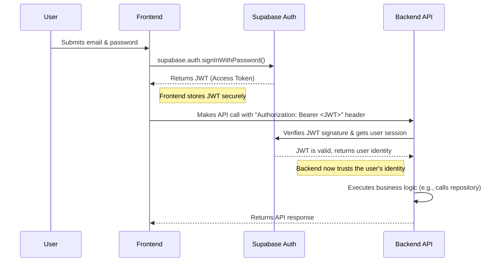

# Backend Architecture

This section details the structure and patterns for the backend, which will be implemented using Next.js API Routes.

### Service Architecture (Serverless)

We will follow the file-system based routing conventions of Next.js for our API. This is a serverless approach, where each API route is a self-contained function.

**Function Organization:**
The API routes will be organized by resource within the `src/app/api/` directory.

```text
src/app/api/
├── products/
│   ├── route.ts        # Handles GET (list) and POST (create) for /api/products
│   └── [productId]/
│       └── route.ts    # Handles GET (one), PUT, DELETE for /api/products/{productId}
├── sales/
│   └── route.ts        # Handles POST for /api/sales
└── stores/
    └── route.ts
```

### Database Architecture

- **Schema Design:** The database schema is defined in the "Database Schema" section above, using PostgreSQL DDL and leveraging Supabase's Row-Level Security for data isolation.
- **Data Access Layer:** We will implement the **Repository Pattern**. For each core data model (e.g., `Product`), a corresponding repository class (e.g., `ProductRepository`) will be created. This class will encapsulate all the database query logic (SQL) for that model. The API route handlers will use these repositories to interact with the database, keeping the route handlers clean and separating business logic from data access concerns.

### Authentication and Authorization

- **Authentication Flow:** Authentication will be handled by Supabase Auth. The client-side frontend will interact with Supabase directly to sign users in and get a JSON Web Token (JWT). This JWT will then be sent with every API request to the backend.
- **Authorization:** The backend will verify the JWT on every protected API request. Authorization logic (i.e., what a user is *allowed* to do) will be enforced at two levels:
    1.  **API Route Middleware:** Middleware can check for high-level roles (e.g., is the user an 'owner'?)
    2.  **Database (RLS):** Row-Level Security policies in the database provide the ultimate guarantee that a user can only ever access data from their own store.

**Auth Flow Diagram:**


### Returns Handling Services

The sales and purchase return functionalities will be implemented as new services following the existing architectural patterns.

#### New API Routes

New API routes will be created to handle the endpoints defined in the API Specification:

```text
src/app/api/
├── sales-returns/
│   ├── route.ts        # Handles POST for /api/sales-returns
│   └── [returnId]/
│       └── route.ts    # Handles GET for /api/sales-returns/{returnId}
└── purchase-returns/
    └── route.ts        # Handles POST for /api/purchase-returns
```

#### New Repositories

To maintain the separation of concerns, new repositories will be created for the new data models:
-   `SalesReturnRepository`: Will manage all database operations for the `SalesReturn` and `SalesReturnItem` tables.
-   `PurchaseReturnRepository`: Will manage all database operations for the `PurchaseReturn` and `PurchaseReturnItem` tables.

#### Core Logic for Sales Returns (`POST /api/sales-returns`)

The `sales-returns/route.ts` handler will contain the primary business logic for creating a sales return. The sequence of operations will be:

1.  **Validate Input**: Ensure the request body matches the `NewSalesReturn` schema.
2.  **Verify Original Sale**: Check that the `original_sale_id` exists and belongs to the user's store.
3.  **Create `SalesReturn` Record**: Use `SalesReturnRepository` to create a new `SalesReturn` record in the database with a status of `requested` or `approved`.
4.  **Create `SalesReturnItem` Records**: For each item in the request, create a corresponding `SalesReturnItem` record linked to the new `SalesReturn`.
5.  **Update Inventory**: For each returned item, use `ProductRepository` to increase the `quantity` of the corresponding product in the `Product` table.
6.  **Handle Refund**: (Future Scope) Integrate with a payment service to process the refund or issue store credit. For now, this will be a manual step reflected by the `total_refund_amount`.
7.  **Return Response**: Respond with the newly created `SalesReturn` object.

This entire sequence should be wrapped in a database transaction to ensure atomicity. If any step fails, the entire transaction should be rolled back.

### Low-Stock Alert Service

A new service will be created to expose products that are running low on stock.

#### New API Route

A new read-only API route will be created:
```text
src/app/api/
└── products/
    └── low-stock/
        └── route.ts    # Handles GET for /api/products/low-stock
```

#### Core Logic (`GET /api/products/low-stock`)

The `low-stock/route.ts` handler will:
1.  Use the `ProductRepository` to query the database.
2.  The query will select all products for the user's store where `quantity` <= `reorder_level`.
3.  The handler will return the array of matching `Product` objects.
