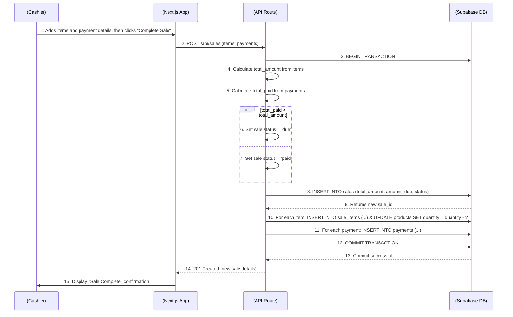
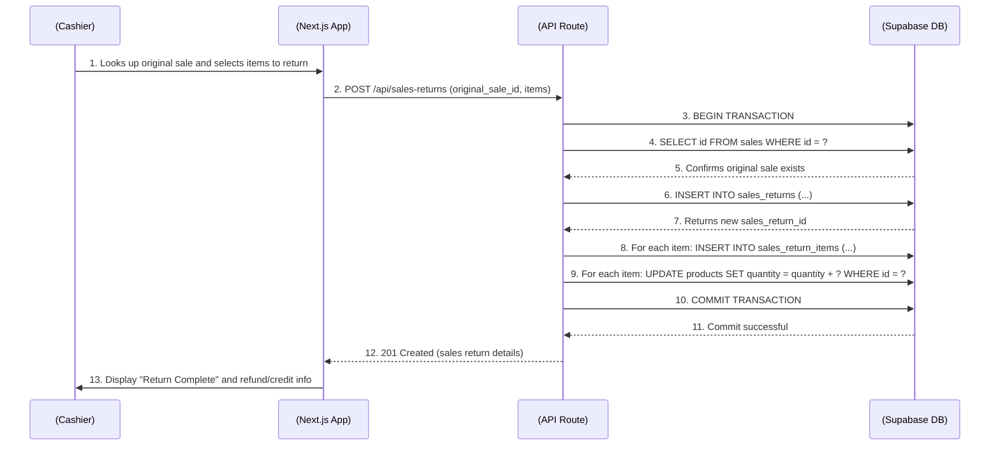

# Core Workflows

This section uses sequence diagrams to illustrate critical user journeys.

### Point of Sale (POS) Transaction Workflow

This diagram illustrates the workflow for an in-store POS transaction with payment processing.

### Sales Return Workflow

This diagram illustrates the process for a cashier processing a customer's return at the Point of Sale.

