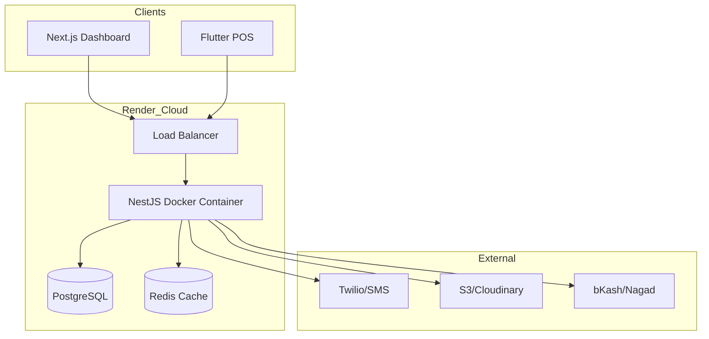

# High Level Architecture

### Technical Summary

The Retail SaaS platform is architected as a **Containerized Monorepo**. It prioritizes **Type Safety** through an all-TypeScript web/backend core, while leveraging **Flutter** for a high-performance mobile POS. The system is deployed as independent Docker services on **Render.com**, providing a balance between the simplicity of a PaaS and the control of a containerized environment.

### Platform and Infrastructure Choice

**Platform:** Render.com
**Key Services:** Render Web Services (Docker), Render Managed PostgreSQL, Render Redis.
**Containerization:** Docker is used for all service deployments to ensure environment parity and portability.

### Repository Structure

**Structure:** Monorepo (using npm workspaces and Turborepo)
**Organization:**
- `apps/backend`: NestJS API (Node.js/TypeScript).
- `apps/frontend`: Next.js Web Dashboard.
- `apps/mobile`: Flutter Mobile Application.
- `packages/*`: Shared database schemas, types, and validation logic.

### High Level Architecture Diagram

### Architectural Patterns

-   **Polyglot Monorepo:** Shared TypeScript types and validation across web/backend, with Flutter as a high-fidelity mobile consumer.
-   **Dependency Injection (NestJS):** Architecture inspired by Spring Boot for maintainability and testability in the backend.
-   **Docker-First Deployment:** Every application is containerized, ensuring that "what works locally works in production."
-   **Centralized API Gateway:** The NestJS backend serves as the single entry point for all business logic and external integrations.
