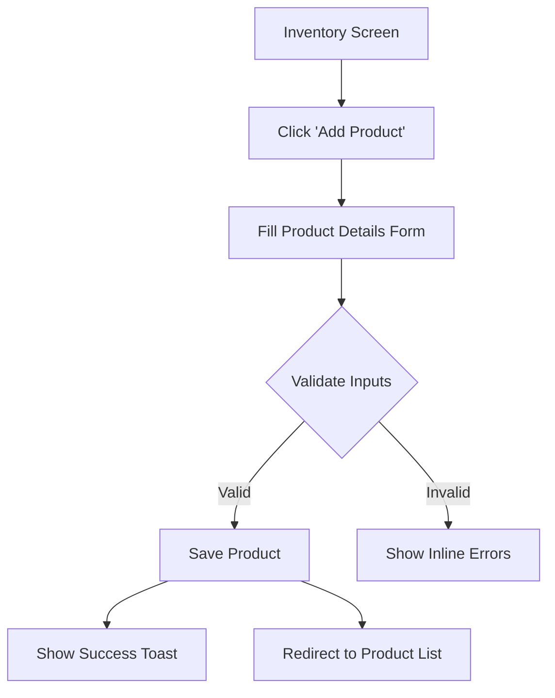

# Grocery SaaS UI/UX Specification

This document defines the user experience goals, information architecture, user flows, and visual design specifications for Grocery SaaS's user interface. It serves as the foundation for visual design and frontend development, ensuring a cohesive and user-centered experience.

## Overall UX Goals & Principles

### Target User Personas
- **Shop Owner:** Small grocery shop owners in diverse regions, potentially with limited technical literacy. They prioritize ease of use, quick transactions, and clear inventory management.
- **Shop Employee:** Staff assisting customers, needing efficient POS operations and stock checking.
- **Customer (E-commerce):** End-users browsing and purchasing groceries online, expecting a smooth, intuitive shopping experience.

### Usability Goals
- **Ease of Learning:** New users (especially shop owners) should be able to complete core tasks (e.g., a sale, adding inventory) within 5-10 minutes of first use.
- **Efficiency of Use:** Experienced users should be able to perform frequent tasks (e.g., processing multiple sales, updating stock levels) with minimal clicks and rapid response times.
- **Error Prevention:** The system should guide users to prevent common mistakes, with clear validation and confirmation for critical or destructive actions.
- **Memorability:** Infrequent users should be able to return to the system and easily recall how to perform tasks without extensive relearning.

### Design Principles
1.  **Radical Simplicity:** Prioritize clear, uncluttered interfaces and straightforward workflows over feature complexity.
2.  **Reliability & Trust:** Ensure consistent performance and accurate data, building user confidence.
3.  **Contextual Guidance:** Provide just-in-time help and clear feedback, especially for less tech-savvy users.
4.  **Mobile-First & Responsive:** Design for optimal experience across various devices, from mobile phones to tablets and desktops.
5.  **Accessibility by Default:** Adhere to WCAG AA standards to ensure usability for all users.

### Change Log

| Date | Version | Description | Author |
|---|---|---|---|
| 2025-10-17 | 1.0 | Initial Draft | Sally (UX Expert) |
| 2025-11-26 | 2.0 | Updated with SMS Notification flows and detailed screen layouts | Sally (UX Expert) |

## Information Architecture (IA)

### Site Map / Screen Inventory

```mermaid
graph TD
    A[Login/Auth] --> B[Dashboard]
    B --> C[POS (Point of Sale)]
    B --> D[Inventory Management]
    B --> E[Sales & Reports]
    B --> F[Customers]
    B --> G[Settings]
    B --> H[Notification Center]
    D --> D1[Products List]
    D --> D2[Suppliers]
    D --> D3[Stock Adjustments]
    E --> E1[Daily Sales]
    E --> E2[Order History]
    E --> E3[Analytics]
    F --> F1[Customer List]
    F --> F2[Loyalty Programs]
    G --> G1[User Management]
    G --> G2[Store Profile]
    G --> G3[Payment Methods]
    G --> G4[Integrations (SMS/Payment)]
```

### Navigation Structure

**Primary Navigation:** A persistent sidebar (desktop) or bottom tab bar (mobile) providing quick access to major modules: Dashboard, POS, Inventory, Sales, Customers, Settings.

**Secondary Navigation:** Contextual navigation within each major module (e.g., tabs for Products/Suppliers within Inventory).

**Breadcrumb Strategy:** Clear breadcrumbs (e.g., "Inventory > Products > Add Product") to indicate location and allow easy upward navigation.

## User Flows

### Flow: Complete a Sale with SMS Notification

**User Goal:** Process a customer purchase quickly and ensure they receive a digital receipt via SMS.

**Entry Points:** POS Screen

**Success Criteria:** Sale recorded, inventory updated, SMS sent to customer.

#### Flow Diagram
```mermaid
graph TD
    A[Start: POS Screen] --> B{Add Items to Cart}
    B --> C[Review Cart Total]
    C --> D{Select Payment Method}
    D --> E[Enter Customer Phone (Optional)]
    E --> F[Confirm Payment]
    F --> G{Payment Successful?}
    G -- Yes --> H[Show Success Screen]
    G -- No --> I[Show Error & Retry]
    H --> J[System Sends SMS Async]
    H --> K[Print Receipt (Optional)]
    H --> L[Return to New Sale]
```

#### Edge Cases & Error Handling:
- **Invalid Phone Number:** Validate phone number format before submission. If invalid, show inline error "Please enter a valid mobile number".
- **SMS Service Down:** If SMS fails silently in background, do not block the UI. Log the error for admin review.
- **Payment Failure:** Clear error message explaining why (e.g., "Insufficient Funds", "Network Error") and allow retry.

**Notes:** The SMS step is automated on the backend; the UI only needs to collect the phone number.

### Flow: Manage Inventory (Add Product)

**User Goal:** Add a new product to the store inventory.

**Entry Points:** Inventory Dashboard > "Add Product" Button

**Success Criteria:** Product saved to database and visible in list.

#### Flow Diagram


#### Edge Cases & Error Handling:
- **Duplicate SKU:** If SKU exists, show error "Product with this SKU already exists".
- **Unsaved Changes:** If user tries to leave form with unsaved data, show confirmation modal "Discard changes?".

## Wireframes & Mockups

**Primary Design Files:** [Figma Project Link Placeholder]

### Key Screen Layouts

#### Screen: Point of Sale (POS)
**Purpose:** The core interface for processing sales. Optimized for speed and touch interaction.

**Key Elements:**
- **Product Grid/List:** Left/Center panel showing available products with images and prices. Search bar at top.
- **Cart Panel:** Right sidebar (or slide-up on mobile) showing added items, quantities, subtotals, and tax.
- **Customer Input:** Field to enter/search customer name or mobile number (for SMS).
- **Payment Action Bar:** Large "Pay" button and quick payment method toggles (Cash, Card, Mobile Pay).

**Interaction Notes:** Tapping a product adds 1 unit. Long-press allows quantity edit. "Pay" triggers the Payment Modal.

#### Screen: Inventory List
**Purpose:** View and manage stock levels.

**Key Elements:**
- **Filter/Search Bar:** Filter by category, low stock status, or search by name/SKU.
- **Data Table:** Columns for Image, Name, SKU, Price, Current Stock, Status (In Stock/Low Stock).
- **Quick Actions:** "Edit" and "Adjust Stock" buttons per row.
- **Low Stock Indicator:** Red badge or row highlight for items below reorder level.

**Interaction Notes:** "Adjust Stock" opens a quick modal to +/- quantity without leaving the list.

## Component Library / Design System

**Design System Approach:** We will build a custom system using **Shadcn/UI** (based on Radix UI) + **Tailwind CSS**. This provides accessible, unstyled primitives that we can style to match our "Radical Simplicity" aesthetic.

### Core Components

#### Component: Action Button
**Purpose:** Primary user interaction trigger.

**Variants:**
- **Primary:** Solid Green (#4CAF50). Used for "Pay", "Save", "Confirm".
- **Secondary:** Outlined/Ghost. Used for "Cancel", "Back", "Export".
- **Destructive:** Solid Red (#F44336). Used for "Delete", "Void Sale".

**States:** Default, Hover (slightly darker), Active (pressed), Disabled (greyed out, no interaction), Loading (spinner replaces text).

**Usage Guidelines:** Use Primary only once per view for the main action.

#### Component: Status Badge
**Purpose:** Indicate state of an entity (Order, Product).

**Variants:**
- **Success:** Green bg/text. (e.g., "Paid", "In Stock")
- **Warning:** Orange bg/text. (e.g., "Low Stock", "Pending")
- **Error:** Red bg/text. (e.g., "Cancelled", "Out of Stock")

**Usage Guidelines:** Place next to the entity name or in a status column.

## Branding & Style Guide

### Visual Identity
**Brand Guidelines:** Clean, modern, trustworthy.

### Color Palette

| Color Type | Hex Code | Usage |
|---|---|---|
| Primary | #4CAF50 | Main interactive elements, primary calls to action |
| Secondary | #FFC107 | Accent elements, secondary actions |
| Accent | #2196F3 | Highlighting, notifications |
| Success | #4CAF50 | Positive feedback, confirmations |
| Warning | #FF9800 | Cautions, important notices |
| Error | #F44336 | Errors, destructive actions |
| Neutral | #212121, #757575, #BDBDBD, #EEEEEE, #FAFAFA | Text, borders, backgrounds |

### Typography
- **Primary:** Roboto (Headings)
- **Secondary:** Open Sans (Body)
- **Monospace:** Fira Code (Data/Code)

**Type Scale:**
- H1: 36px / Bold
- H2: 28px / Semi-Bold
- Body: 16px / Regular

### Iconography
**Icon Library:** Lucide React (clean, consistent SVG icons).
**Usage Guidelines:** Use outlined icons for general UI, filled icons for active states.

## Accessibility Requirements

**Standard:** WCAG 2.1 Level AA

**Key Requirements:**
- **Visual:** Minimum 4.5:1 contrast for text. Visible focus rings on all interactive elements.
- **Interaction:** Full keyboard navigability (Tab, Enter, Space, Esc). Touch targets min 44x44px.
- **Content:** All images must have `alt` text. Forms must have associated `<label>` elements.

**Testing Strategy:** Automated audit via `axe-core` in CI/CD + Manual keyboard testing for every new feature.

## Responsiveness Strategy

### Breakpoints
- **Mobile:** < 576px (Smartphones)
- **Tablet:** 577px - 992px (Tablets/iPads)
- **Desktop:** > 993px (Laptops/Monitors)

### Adaptation Patterns
- **Layout:** Single column on mobile, multi-column on desktop. Sidebars become bottom tabs or hamburger menus on mobile.
- **Tables:** On mobile, complex tables transform into "Card Lists" to avoid horizontal scrolling.
- **Navigation:** "App-like" bottom navigation for core actions on mobile.

## Animation & Micro-interactions

**Motion Principles:** Quick, subtle, informative. Max 300ms duration.

**Key Animations:**
- **Modal Slide-up:** Slide up from bottom on mobile, fade in/scale up on desktop. (300ms, ease-out)
- **Toast Notification:** Slide in from top-right (desktop) or top-center (mobile). Auto-dismiss after 3s.
- **Button Feedback:** Subtle scale down (0.95x) on press.

## Performance Considerations

- **Page Load:** < 2s FCP on 3G.
- **Interaction:** < 100ms response to taps.
- **Design Strategies:**
    - Lazy load below-the-fold images.
    - Skeleton screens instead of spinners for initial data load.
    - Optimistic UI updates for "Add to Cart" and "Like" actions.

## Next Steps

### Immediate Actions
1.  Create high-fidelity Figma mockups for the **POS** and **Inventory** screens based on these layouts.
2.  Prototype the **SMS Notification flow** to test user understanding of the "optional" phone number field.
3.  Review this spec with the Lead Developer to confirm component feasibility.

### Design Handoff Checklist
- [ ] All user flows documented
- [ ] Component inventory complete
- [ ] Accessibility requirements defined
- [ ] Responsive strategy clear
- [ ] Brand guidelines incorporated
- [ ] Performance goals established

## Checklist Results
*(Pending Checklist Execution)*
